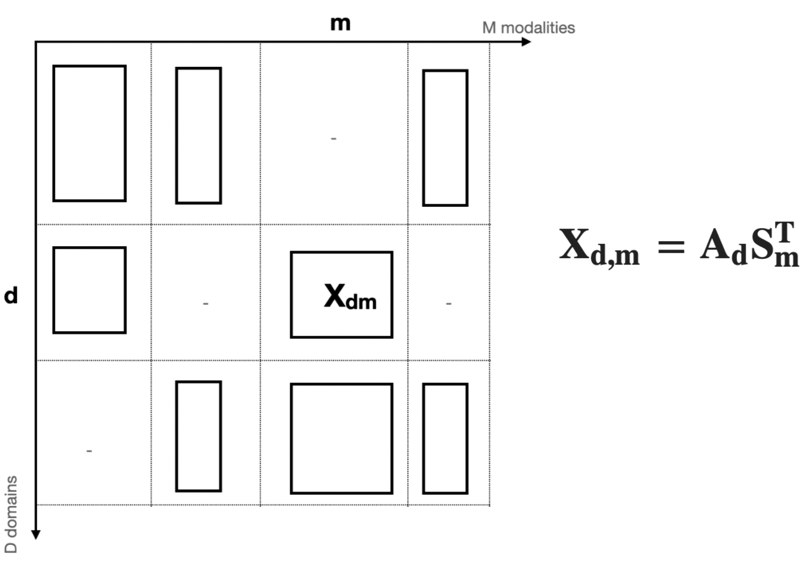
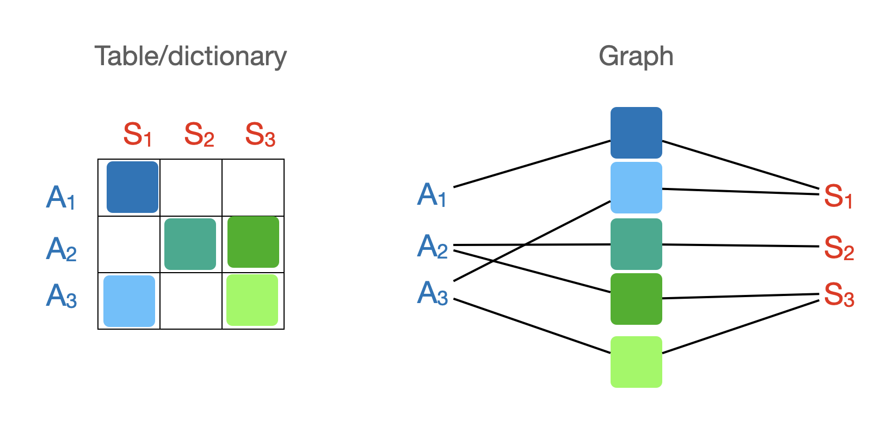

# pathfinder

## Goals

### Vanilla PathFinder
PathFinder is a toolbox for finding common patterns in a set of related datasets (matrices). 

As an example, say we have multiple datasets arranged into $D$ domains and $M$ modalities. For example, domains can be "species", and modalities can be different types of measurements per species. 

Each dataset is a matrix $\mathbf{X_{d,m}}$ denoting data from domain $d\in \{1,\dots,D\}$ and modality $m\in \{1,\dots,M\}$. The size of such matrix is $r_d\times c_m$, i.e. it has $r_d$ rows and $c_m$ columns. 

Through this notation, it can be seen that within any given domain, all datasets share the row dimension, and within any given modality, all the datasets share the column dimension.

We further assume that we don't necessarily have access to all modalities in all domains. We are missing some of the $\mathbf{X_{d,m}}$'s.

Our objective is to find a set of low-rank matrix decompositions $\mathbf{X_{d,m}} = \mathbf{A_{d}}\mathbf{S_{m}^T}$ for all $d$ and all $m$. For a rank-$r$ decomposition, we have $\mathbf{A_d}\in \mathbb{R}^{r_d}\times\mathbb{R}^{r}$ and $\mathbf{S_m}\in \mathbb{R}^{c_m}\times\mathbb{R}^{r}$.

Such decompositions mean that we want to find common subspaces within each domain $d$ and each modality $m$. 

The above decompositions are ill-defined unless we add additional constraints on the matrices $\mathbf{A_d}$ and $\mathbf{S_m}$. There are many options, for example L2-regularisation, or positivity, etc.

As we said earlier, some of the modalities might be missing in some of the domains/species. We define a mask $\mathcal{M}$ as the set of matrices that we do have access to, i.e. $\mathcal{M}=\left\{(d,m) \mid \mathbf{X_{d,m}} \text{ exists} \right\}$. 



Now we can write the overall loss function as:

$$ \mathrm{Loss} = \sum_{(d,m)\in\mathcal{M}} \frac{1}{2}\left\lVert \mathbf{X_{d,m}}-\mathbf{A_{d}}\mathbf{S_{m}^T} \right\rVert^2_{\mathrm{F}} + \alpha \sum_{d=1}^D \left\lVert \mathbf{A_d} \right\rVert^{2}_2 + \alpha \sum_{m=1}^M \left\lVert \mathbf{S_{m}} \right\rVert^2_2$$

### Extensions

Below are some extensions to the framework we set above:

**1) Datasets as graphs.**

The datasets may not necessarily be organised into a neat table of domains-by-modalities. A more general organisation is to have a list of datasets and two lists of lookup tables that link the datasets to the set of left/right matrices in a decomposition. 

The below diagram shows how a data table relates to a data graph:



Mathematically, we can re-write our matrix decompositions as:

$$X_k = A_{\alpha(k)}S_{\beta(k)}^T$$

where $\alpha(\cdot)$, and $\beta(\cdot)$ are lookup functions that map the data index $k$ to the indices in the matrices sets $\{A_1,A_2,\dots\}$ and $\{S_1,S_2,\dots\}$.

**2) SVD-style decomposition.**

The decompositions $X_{d,m} = A_d S_m^T$ assume that the shared modes all have the same "amplitudes" across the datasets. One extension would be to find decompositions of the type "singular value decomposition", where we estimate between-data shared modes and within-data amplitudes: 

$$X_{k} = U_d D_k V_m^T$$

where $D_k$ are diagonal matrices and $U_d$ and $V_d$ are unitary matrices (i.e. $U_d^TU_d=V_m^TV_m=I$)

**3) ICA.**

When estimating the decomposition $X_{d,m} = A_dS_m^T$, any rotation of the matrices $A_d$ and $S_m$ will lead to an equivalent decomposition with the same loss function. We can use ICA to find a rotation that maximises non-Gaussianity, which usually leads to more interpretable components. The rotation can be found for either the set of $A_d$'s, the set of $S_m$'s, or both (through concatenation).


## Running PathFinder

Detailed examples can be found in the project [Notebooks](notebooks/Readme.md). Below are short example.

### Using a data dictionary

We start by organising our data into a table:

```python
data_dict = {
    'Human'  : {'FMRI' : X1,   'DMRI': X2, 'GeneExp': X3},
    'Monkey' :,{'FMRI' : None, 'DMRI': X4, 'GeneExp': None},
    'Mouse'  : {'FMRI' : None, 'DMRI': X5, 'GeneExp': X6},
}
```
In this example, we have 3 domains and 3 modalities. Some of the combinations of modalities and domains are missing (set to `None`). 

To run the PathFinder, we create a matrix decomposition object and the run the `fit()` method. To do a L2-regularision, we use the `Ridge` class from sklearn. We can use `method_kwargs` to pass arguments to the `Ridge` object.

```python
from pathfinder import decomp
from sklearn.linear_model import Ridge
algo = decomp.JointOuterDecomp(n_components=5,
                               method=Ridge, method_kwargs={'alpha':1e2})

algo.fit(data_dict)
```

You can look at the loss function over iterations with:
```python
import matplotlib.pyplot as plt
_ = plt.plot(algo._loss)
```

And you can look at the predictions with:

```python
data_pred = algo.predict(as_dict=True)
```

### Using a data graph

We can extend the table/dict organisation to a graph by using lookups. Below is an example using the data dictionary from the example above.

```python
data_list = [X1,X2,X3,X4,X5,X6]
alpha     = [0, 0, 0, 1, 2, 2]
beta      = [0, 1, 2, 1, 1, 2]
```

We can visualise the graph as a table (when possible):

```python
from pathfinder import utils
utils.Lookup_to_DataTable(data_list, alpha, beta, 
                          row_names=['Human', 'Monkey', 'Mouse'], 
                          col_names=['FMRI','DMRI','GeneExp'])
```

### Using the SVD-style approach

Here we replace the two-matrix decomposition with a three-matrix decomposition including orthonormal (unitary) left/right matrices and a diagonal matrix in the middle.

```python
from pathfinder import decomp
algo = decomp.JointSVD(n_components=5)

algo.fit(data_dict)

```

When using a data list instead of a dict, we need to provide the lookup tables to the fitting function:

```python
algo.fit(data_list, alpha, beta)
```

### Using ICA

Here we choose the option of running ICA after the decomposition.

```python
from pathfinder import decomp
algo = decomp.JointSVD(n_components=5, do_ica='both')

algo.fit(data_dict)

```
